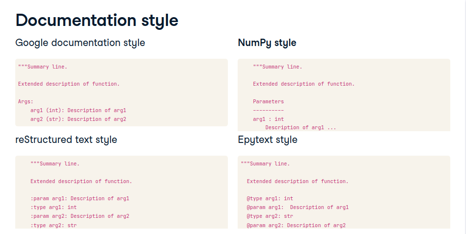
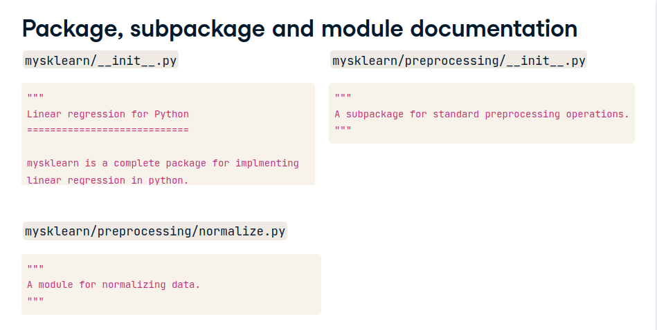

# ft_package

A sample test package  

## Package Structure

### Scripts

    A python file which is run like python "myscript.py"  

### Package

    A directory full of python code to be imported

### Subpackage

    A smaller package inside a package

### Module

    A python file inside a package which stores the package code  

### Library

    Either a package, or a collection of packages

### Package diretory tree

    my_package/
        |-- simple_module.py
        |-- __init.py__

    * directory my_package - is a python package
    * file simple_module.py - contains all the package code
    * file __init__.py - marks this directory as a python package

### Documentation

    Helps users use your code  
    Document each:  
    * function
    * class
    * class method  

    Can be access by:
        $ help(package_name.function_name) 
    
#### Documentation Style

    Command:  
        $ pyment -w -o numpydoc <function.py>  
            * -w -> overwrite file  
            * -o numpydoc -> output in NumPy style

## Step by step

    1 - Create a folder with the ackage name  

    2 - Create the following files inside this folder:  
        * init.py  
        * setup.py  
        * README.md  
        * LICENCE.txt  

### init.py file

    Importe the functions inside, so it is possible to access the functions just importing the package:  
        * import ft_package
    If the function is not in the file:
        * from ft_package import <function>

### setup.py

### Wheel (Binary distribution)

    Binary version of the code ready for publication.  Contein everything that python package managment nedds to know to install the package.

## Installation
  
    $ pip install wheel
    Into the package folder:  
        * wheel
            $ python setup.py bdist_wheel

you can install the package using pip  

